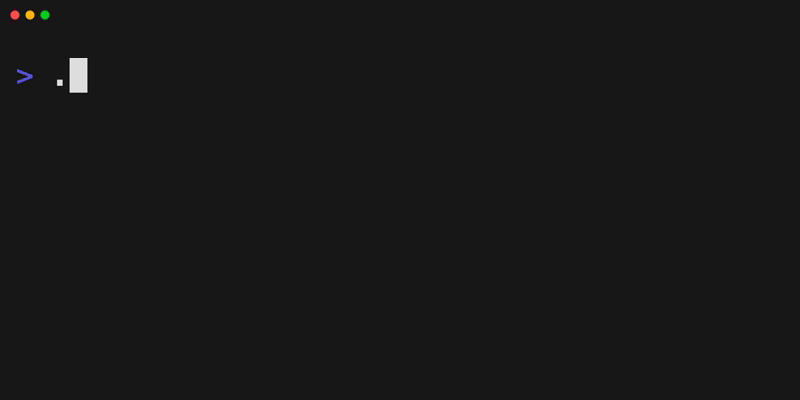

# Ratatui Code Editor widget

A code editor widget for [Ratatui](https://github.com/ratatui/ratatui), built with syntax highlighting powered by Tree-sitter.

## Demo




## Features

- 🎨 **Syntax Highlighting** - Powered by Tree-sitter with support for multiple languages
- 📝 **Text Editing** - Full text editing capabilities with cursor movement
- 🖱️ **Mouse Support** - Click to position cursor, drag to select text
- 📋 **Copy/Paste** - Clipboard integration with system clipboard
- 🔄 **Undo/Redo** - Full history management for edit operations
- 🎯 **Text Selection** - Visual text selection with keyboard and mouse
- 🌈 **Themes** - Customizable color themes for syntax highlighting
- 📱 **Responsive** - Adapts to terminal window size changes
- 🔖 **Visual Highlight Marks** - Highlight specific regions in the editor

## Syntax Highlighting: Fast, Cached, and Wide-Row Ready

The Ratatui Code Editor features blazing fast syntax highlighting powered by [Tree-sitter](https://tree-sitter.github.io/). Tree-sitter parses your code in real time, enabling accurate and context-aware highlighting for all supported languages.

**Performance Features:**
- **Super Fast:** Only the visible portion of the code is highlighted on each render, making even large files feel snappy.
- **Smart Caching:** Highlighting results are cached per visible region, so scrolling and editing are smooth and efficient.
- **Wide Row Support:** Handles long lines and wide code gracefully, ensuring correct highlighting and cursor placement even with complex Unicode or tab characters.

This approach means you get instant, editor-quality highlighting in your terminal, with no lag—even for big files or wide code blocks.

## Supported Languages

- Rust
- Python
- JavaScript
- TypeScript
- C
- C++
- Go
- C#
- Java
- Html
- Css
- Yaml
- Toml
- Json
- Bash
- Markdown

## Quick Start

Add this to your `Cargo.toml`:

```toml
anyhow = "1.0"
crossterm = "0.29"
ratatui = "0.29"
ratatui-code-editor = { git = "https://github.com/vipmax/ratatui-code-editor" }
```

### Basic Usage

```rust
use crossterm::{
    event::{self, Event, KeyCode},
    execute,
    terminal::{
        enable_raw_mode, disable_raw_mode, 
        EnterAlternateScreen, LeaveAlternateScreen
    },
};
use ratatui::{Terminal, backend::CrosstermBackend, layout::Position};
use ratatui_code_editor::editor::Editor;
use ratatui_code_editor::theme::vesper;
use std::io::stdout;

fn main() -> anyhow::Result<()> {
    enable_raw_mode()?;
    execute!(stdout(), EnterAlternateScreen)?;
    
    let backend = CrosstermBackend::new(stdout());
    let mut terminal = Terminal::new(backend)?;
    
    let content = "fn main() {\n    println!(\"Hello, world!\");\n}";
    let mut editor = Editor::new("rust", content, vesper());
    let mut editor_area = ratatui::layout::Rect::default();
    
    loop {
        terminal.draw(|f| {
            let area = f.area();
            editor_area = area;
            f.render_widget(&editor, editor_area);
            
            let cursor = editor.get_visible_cursor(&area);
            if let Some((x,y)) = cursor {
                f.set_cursor_position(Position::new(x, y));
            }
        })?;
        
        if let Event::Key(key) = event::read()? {
            if key.code == KeyCode::Esc {
                break;
            }
            editor.input(key, &editor_area)?;
        }
    }
    
    disable_raw_mode()?;
    execute!(stdout(), LeaveAlternateScreen)?;
    Ok(())
}
```

## Examples

Run the included examples to see the editor in action:

```bash
# Minimal editor example
cargo run --release --example minimal

# Half-screen editor
cargo run --release --example half

# Split-screen editor
cargo run --release --example split

# Editor
cargo run --release --example editor <filename>
```

## Key Bindings

### Navigation
- **Arrow Keys** - Move cursor

### Editing
- **Any printable character** - Insert character
- **Delete** - Delete characters
- **Enter** - Insert new line
- **Tab** - Insert tab or spaces
- **Ctrl+D** - Duplicate
- **Ctrl+X** - Cut
- **Alt+Enter** - go to next line 


### Selection
- **Shift + Arrow Keys** - Select text
- **Ctrl+A** - Select all
- **Mouse drag** - Select text with mouse
- **Mouse double click** - Select word with mouse
- **Mouse triple click** - Select line with mouse

### Clipboard
- **Ctrl+C** - Copy selected text
- **Ctrl+V** - Paste from clipboard
- **Ctrl+X** - Cut selected text

### History
- **Ctrl+Z** - Undo
- **Ctrl+Y** - Redo

## Themes

The editor comes with built-in themes:

- `vesper` - Dark theme default
- Custom themes can be created by providing color mappings

```rust
let custom_theme = vec![
    ("keyword", "#ff6b6b"),
    ("string", "#4ecdc4"),
    ("comment", "#95a5a6"),
    ("function", "#f39c12"),
];
let editor = Editor::new("rust", content, custom_theme);
```

## Architecture

The editor is built with several key components:

- **Editor** - Main widget that handles rendering and input
- **Code** - Text buffer with Tree-sitter integration for syntax highlighting
- **History** - Undo/redo functionality with edit tracking
- **Selection** - Text selection state management
- **Theme** - Color scheme management

## Dependencies

- `ratatui` - Terminal UI framework
- `tree-sitter` - Syntax highlighting parser
- `ropey` - Efficient text buffer
- `crossterm` - Cross-platform terminal manipulation
- `arboard` - Clipboard access
- `unicode-width` - Unicode text width calculation

## Contributing

Contributions are welcome! Please feel free to submit issues, feature requests, or pull requests.

## License

This project is licensed under the MIT License - see the LICENSE file for details.

## Acknowledgments

- Built on top of the excellent [Ratatui](https://github.com/ratatui/ratatui) TUI framework
- Syntax highlighting powered by [Tree-sitter](https://tree-sitter.github.io/)
- Text editing functionality inspired by modern code editors